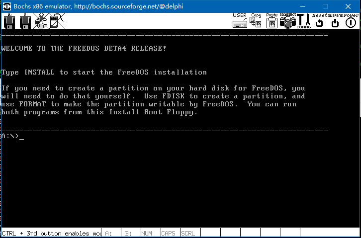
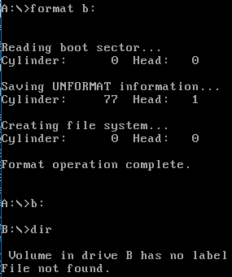
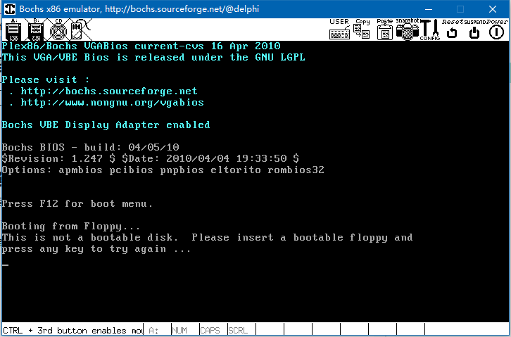

# 1. 主引导程序的扩展
## 1.1. 主引导程序
- 继BIOS之后运行的第一个程序
- 存储于第 0 扇区
- 以 <font color=red>0x55aa</font> 作为结束标记
- 大小不超过<font color=red>512</font>字节

## 1.2. 限制
主引导程序的代码量不能超过 <font color=red>512</font> 字节！！

## 1.3. 突破限制的思路
- 主引导程序
        1. 完成最基本的初始化工作
        2. 从存储介质中加载程序到内存中
        3. 将控制权交由新加载的程序执行
        4. ......


## 1.4. 问题（文件系统的引入）
主引导程序如何加载存储介质中的其它程序 ?
> 基于操作系统: 直接指定程序所对应的文件名, 读取就行了(c/c++中文件的读写操作)
> 但现在没有操作系统, 现在是直接汇编, 运行于硬件的程序
> 要解决这个问题, 需引进文件系统的概念

## 1.5. FAT12文件系统
### 1.5.1. 文件系统概念
- 本质 : 存储介质上组织文件数据的方法 (<font color=red>数据组织的方式</font>)
- 例 : FAT12 文件格式

> FAT1 和 FAT2是两个表, 指明数据间的关系, FAT1 和 FAT2 一样, 相互地备份

### 1.5.2. 示例
- <font color=red>FAT12</font> 是 DOS 时代的早期文件系统
- <font color=red>FAT12</font> 结构非常简单，<font color=red>一直沿用于软盘</font>
> 现在软盘已经基本淘汰了, 但课程是基于虚拟软盘的, 因此依赖 FAT12 文件系统
- <font color=red>FAT12</font> 的基本组织单位 (三板斧)
    - 字节 (Byte) : 基本数据单位
    - 扇区 (Sector) : 磁盘中的数据单元
        > 比如一个扇区512个字节
    - 簇 (Cluster) : 一个或多个扇区

## 1.6. 解决方案
- <font color=red>使用 FAT12 对软盘 (data.img) 进行格式化</font>
- 编写可执行程序 (Loader), 并将其拷贝到软盘中
- 主引导程序 (Boot) 在文件系统中查找Loader
- 将 Loader 复制到内存中，并跳转到入口处执行

# 2. 实验：往虚拟软盘中写入文件
## 2.1. 准备
- 原材料：`FreeDos , Bochs , bximage`
- 步骤：
    - 创建虚拟软盘data.img
    - 在 FreeDos 中进行格式化（FAT12 )
        > FreeDos : 非常原始的一个操作系统
    - 将data.img挂载到Linux中，并写入文件

## 2.2. 将文件写入虚拟软盘
- 将 FreeDos 相关的文件 (bochsrc freedos.img) 拷贝到 Linux (tool/) 中
- 在 tool/ 中创建一张虚拟软盘 : bximage -> fd -> 1.44 -> data.img
- 编写 [<u>bochsrc</u>](vx_attachments/004/tool/bochsrc), 添加 : `floppyb: 1_44="data.img", status=inserted`
    > 将 data.img 这个虚拟软盘插入到 freedos.img 中去, 并且盘符是 b盘

- 启动 freedos.img : bochs -> 6（Begin simulation） -> c


- 格式化 ( 成FAT12文件系统 ), 切换到b盘, 查看b盘中的内容, 为空


- Ubuntu中重新开一个终端窗口, 将freedos中的 b盘(data.img), 挂载到Ubuntu中的一个目录(~/mnt), 并向目录中写入一个文件, 取消挂载.
```
$ mkdir ~/mnt
$ sudo mount -o loop data.img ~/mnt
$ ls ~/mnt
$ sudo vi ~/mnt/test.txt    // 写入内容 : hello girl
$ sudo umount /home/delphi/mnt/
```

- 重新回到 freedos 系统, 再次查看B盘, 里边多了一个文件, 查看文件里边的内容, 确实为上面所写


- 将 data.img 在 windows 中二进制打开,能够查找到所写的字符串


# 3. Boot查找目标文件 (Loader), 并读取文件的内容！

## 3.1. 深入 FAT12 文件系统
- FAT12 文件系统由<font color=red>主引导区</font>(引导程序)，<font color=red>FAT表</font>(FAT 表1,FAT表2)，<font color=red>根目录项表</font>(目录文件项)和<font color=red>文件数据区</font>(文件数据)组成。

| 扇区位置 |   长 度    |    分区    |    内容    |
| ------- | ---------- | --------- | --------- |
| 0       | 1 (512 B)  | 主引导区   | 引导程序   |
| 1       | 9 (4608 B) | FAT表      | FAT 表1    |
| 10      | 9 (4608 B) | FAT表      | FAT 表2    |
| 19      | 14(9728 B) | 根目录项表 | 目录文件项 |
| 33      | ----       | 文件数据区 | 文件数据   |

## 3.2. FAT12 的主引导区
- <font color=red>主引导区</font>存储的比较重要的信息是<font color=red>文件系统的类型</font>，文件系统逻辑扇区总数，每簇包含的扇区数，等。<font color=red>主引导区</font>最后以<font color=red>0x55aa</font>两个字节作为结束，共占用一个扇区。

|      标识      | 偏移量 | 类型 | 大小 |  默认值   |                  说明                  |
| -------------- | ----- | ---- | ---- | --------- | ------------------------------------- |
| BS_JmpBoot     | 0     | db   | 3    |           | 跳转指令                               |
| BS_OEMName     | 3     | db   | 8    | MSWIN4.1  | OEM字符串，必须为8个字符，不足以空格填空  |
| BPB_BytsPerSec | 11    | dw   | 2    | 0x200     | 每扇区字节数                           |
| BPB_SecPerClus | 13    | db   | 1    | 1         | 每簇占用的扇区数                       |
| BPB_RsvdSecCnt | 14    | dw   | 2    | 1         | Boot占用的扇区数                       |
| BPB_NumFATs    | 16    | db   | 1    | 2         | FAT表的记录数                          |
| BPB_RootEntCnt | 17    | dw   | 2    | 0xE0      | 最大根目录文件数                       |
| BPB_TotSecl6   | 19    | dw   | 2    | 0xB40     | 逻辑扇区总数                           |
| BPB_Media      | 21    | db   | 1    | 0xF0      | 媒体描述符                             |
| BPB_FATSzl6    | 22    | dw   | 2    | 9         | 每个FAT占用扇区数                      |
| BPB_SecPerTrk  | 24    | dw   | 2    | 0x12      | 每个磁道扇区数                         |
| BPB_NumHeads   | 26    | dw   | 2    | 2         | 磁头数                                |
| BPB_HiddSec    | 28    | dd   | 4    | 0         | 隐藏扇区数                             |
| BPB_TotSec32   | 32    | dd   | 4    | 0         | 如果BPB_TotSecl6是0,则在这里记录扇区总数 |
| BS_DrvNum      | 36    | db   | 1    | 0         | 中断13的驱动器号                        |
| BS_Reservedl   | 37    | db   | 1    | 0         | 未使用                                 |
| BS_BootSig     | 38    | db   | 1    | 0x29      | 扩展引导标志                           |
| BS_VollD       | 39    | dd   | 4    | 0         | 卷序列号                               |
| BS_VolLab      | 43    | db   | 11   |           | 卷标，必须是11个字符，不足以空格填充      |
| BS_FileSysType | 54    | db   | 8    | FAT12     | 文件系统类型，必须是8个字符，不足填充空格  |
| BOOT_Code      | 62    | db   | 448  | 0x00      | 引导代码，由偏移0字节处的短跳转而来       |
| END            | 510   | db   | 2    | 0x55,0xAA | 系统引导标识                           |

# 4. 实验 ：读取 data.img 中的文件系统信息
## 4.1. 步骤
- 创建Fat12Header结构体类型
- 使用文件流读取前512字节的内容
- 解析并打印相关的信息

## 4.2. 读取FAT12文件系统信息
- 编写代码：[<u>main.cpp</u>](vx_attachments/004/Fat12Test/main.cpp)
- 执行：
```
$ mv data.img ../Fat12Test/
$ cd ../Fat12Test/
$ g++ main.cpp
$ ./a.out
BS_OEMName: FreeDOS    // 这张虚拟软盘是被FreeDOS格式化的
BPB_BytsPerSec: 200    // 512字节
BPB_SecPerClus: 1
BPB_RsvdSecCnt: 1
BPB_NumFATs: 2
BPB_RootEntCnt: e0
BPB_TotSec16: b40
BPB_Media: f0
BPB_FATSz16: 9
BPB_SecPerTrk: 12
BPB_NumHeads: 2
BPB_HiddSec: 0
BPB_TotSec32: 0
BS_DrvNum: 1
BS_Reserved1: 0
BS_BootSig: 29
BS_VolID: 0
BS_VolLab:
BS_FileSysType: FAT12    // 标识文件系统的类型
Byte 510: 55
Byte 511: aa
```

## 4.3. 猜测与验证
- 猜测
freedos在格式化这张虚拟软盘的时候, 在第0扇区不但写入了 fat12相关的这些数据, 并且塞了个主引导程序进去

- 验证
    - 修改并另存[<u>bochsrc</u>](vx_attachments/004/Fat12Test/bochsrc)，更改 data.img 为启动盘
        > 将：
        > `floppya: 1_44=freedos.img, status=inserted`
        > `floppyb: 1_44="data.img", status=inserted`
        > 更改为：
        > `floppya: 1_44="data.img", status=inserted`

    - 启动bochs : bochs -> 6 -> c
    
    > `this is not a bootable disk ...` 就是freedos写进去的主引导程序(仅打印这句提示语句)

## 4.4. 实验结论
- FreeDos中的format程序在格式化软盘的时候<font color=red>自动在第0扇区生成了一个主引导程序</font>，这个主引导程序只打印一个字符串
- <font color=red>文件格式和文件系统都是用于定义数据如何存放的规则</font>，只要遵循这个规则就能够成功读写目标数据

# 5. 小结
- 主引导程序的代码量<font color=red>不能超过 512 字节</font>
- <font color=red>可以通过主引导程序加载新程序的方式突破限制</font>
- 加载新程序需要依赖于文件系统
- FAT12 是一种早期用于软盘的简单文件系统
- FAT12 文件系统的<font color=#d0d>重要信息存储于 0 扇区</font>
